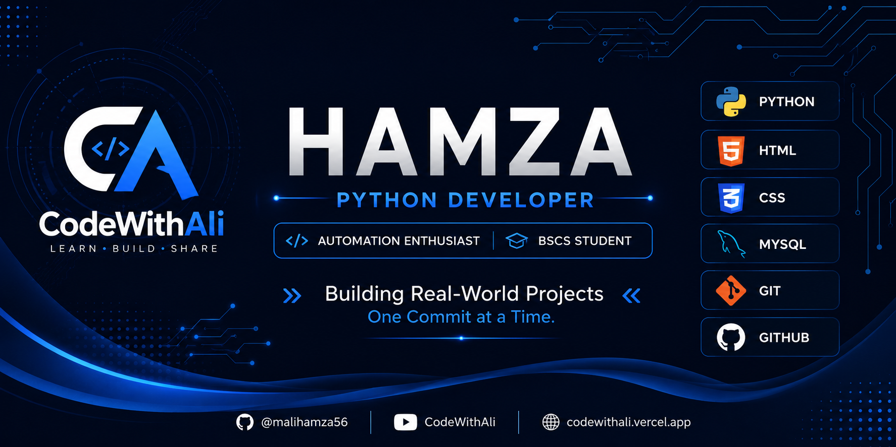

  

---

# 👋 Assalamu Alaikum, I'm Hamza

### 💻 Python Developer | Automation Enthusiast | BS Computer Science Student

*"Building real-world projects one commit at a time."*

---

## 🚀 About Me

I'm a passionate Computer Science student from Pakistan who enjoys solving real-world problems through Python.

Currently, I'm focused on mastering **Python**, **Web Scraping**, **Automation**, and **Backend Development** while documenting my complete coding journey on GitHub.

I believe in learning by building projects instead of just watching tutorials.

---

### 🌱 Currently Learning

- Python
- Web Scraping
- Requests
- BeautifulSoup
- APIs
- Git & GitHub
- HTML & CSS

---

### 🎯 2026 Goals

- 🚀 Become a Professional Python Developer
- 🤖 Learn Automation & Selenium
- 🌐 Master Django
- 💼 Start Freelancing
- ⭐ Contribute to Open Source
- 📚 Build Real-World Projects
---
## 🛠️ Tech Stack

### 👨‍💻 Languages

  

### ⚙️ Tools & Technologies

  

### 📚 Python Libraries

  
  
  

---

## 📊 GitHub Statistics

---

## 🔥 GitHub Streak

---

## 🚀 Featured Projects

| Project | Description |
|---------|-------------|
| 🕷️ **Python Scraping Journey** | Learning and building web scraping projects using Requests & BeautifulSoup. |
| 🌐 **Personal Portfolio** | My responsive portfolio website built with HTML & CSS. |
| 📚 **Python Libraries** | Collection of Python libraries with examples and notes. |
| 🔥 **Future API Projects** | REST API projects and automation scripts coming soon. |

---

## 🌐 Connect With Me

---

## 🏆 GitHub Trophies

---

## 📈 GitHub Activity Graph

---

## 🎯 Current Focus

- 🔭 Building real-world Python projects
- 🌱 Learning Selenium & REST APIs
- 🕷️ Mastering Web Scraping
- 🤝 Looking forward to Open Source contributions
- 🎥 Creating programming content for **CodeWithAli**
---

### 💬 Developer Philosophy

> **"Learning by building. Growing by sharing."**

